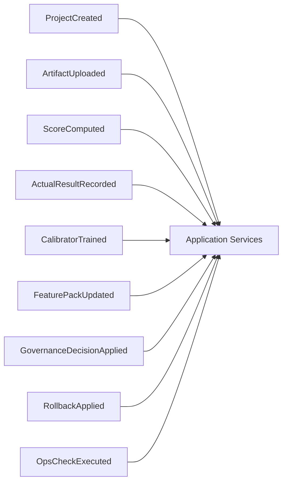

# ADR-003：评分核心、学习闭环、治理闭环、运维巡检四层解耦，保持“分层单体 + 事件化内核”

- 状态：Accepted
- 日期：2026-04-12

## 背景

审计和现有代码都表明，这个系统不是一个适合直接拆微服务的普通 CRUD 平台，而是一个高度强调以下属性的单体型业务系统：

- 可解释评分
- 16 维度、证据、扣分项、建议、对比诊断
- 真实评标结果驱动的学习与治理闭环
- 本地部署、企业内网、低依赖
- health / ready / self-check / doctor / soak / trial-preflight / acceptance / ops-agents

当前仓库的真实模块分布如下：

### 评分核心相关

- `app/engine/scorer.py`
- `app/engine/v2_scorer.py`
- `app/engine/evidence.py`
- `app/engine/evidence_units.py`
- `app/engine/compare.py`
- `app/scoring_diagnostics.py`
- `app/submission_diagnostics.py`

### 学习闭环相关

- `app/feedback_learning.py`
- `app/ground_truth_intake.py`
- `app/engine/reflection.py`
- `app/engine/calibrator.py`
- `app/engine/evolution.py`
- `app/engine/feature_distillation.py`

### 治理闭环相关

- `app/feedback_governance.py`
- `app/storage.py` 中的历史版本能力
- `runtime.py` 内的版本预览、回滚、采纳编排

### 运维巡检相关

- `app/system_health.py`
- `app/trial_preflight.py`
- `app/engine/ops_agents.py`
- `scripts/doctor.sh`
- `scripts/stability_soak.py`

问题不在于这些模块不存在，而在于编排边界长期混叠在 `app/main.py` / `runtime.py` 中。

## 决策

系统维持“分层单体 + 事件化内核”，并按照四层明确边界解耦：

1. 评分核心层
2. 学习闭环层
3. 治理闭环层
4. 运维巡检层

跨层通信优先通过应用服务和领域事件完成，而不是通过跨层直接 import / 直接互调。

## 为什么当前更适合“分层单体 + 事件化内核”，而不是直接拆微服务

### 事实

1. 当前仍依赖本地文件、文件锁、目录结构、DPAPI 安全桌面。
2. 当前边界清理尚未完成，过渡期建议让 `runtime.py` 承载大批过渡逻辑，并用 `runtime_legacy.py` 保留兼容 shim。
3. 评分、学习、治理、巡检共享大量上下文，核心目标是确定性和可回放，而不是吞吐扩展。
4. 现有问题主要是“单体内边界混叠”，不是“单体算力不够”。

### 结论

先做分层单体，收益最大，风险最小：

- 能先把边界整理清楚
- 能保留本地部署和低依赖特征
- 能避免过早引入分布式一致性、链路追踪、服务治理和网络故障面

事件化内核的作用也不是微服务化，而是：

- 把跨域副作用显式化
- 把“同步直调”改成“主事务 + 事件记录 + 可选订阅”
- 为回放、审计、projection 和后续代理诊断提供稳定输入

## 四层边界定义

### 1. 评分核心层

职责：

- 输入归一化
- 规则裁决
- 16 维度聚合
- 扣分项计算
- 证据映射
- 评分解释
- 对比诊断的规则部分

当前对应模块：

- `app/engine/scorer.py`
- `app/engine/v2_scorer.py`
- `app/engine/evidence.py`
- `app/engine/evidence_units.py`
- `app/engine/compare.py`
- `app/scoring_diagnostics.py`
- `app/submission_diagnostics.py`

禁止职责：

- 不训练模型
- 不决定治理是否上线
- 不决定系统封关

### 2. 学习闭环层

职责：

- 真实评标结果回灌
- delta case 构建
- calibration sample 构建
- 校准器训练
- 特征蒸馏
- 反射与演化报告生成

当前对应模块：

- `app/feedback_learning.py`
- `app/ground_truth_intake.py`
- `app/engine/reflection.py`
- `app/engine/calibrator.py`
- `app/engine/evolution.py`
- `app/engine/feature_distillation.py`

禁止职责：

- 不直接写最终线上分数
- 不直接修改生产规则

### 3. 治理闭环层

职责：

- 采纳 / 忽略 / 回退 / 人工确认
- 版本预览
- 影响分析
- 变更留痕
- 已生效产物切换

当前对应模块：

- `app/feedback_governance.py`
- `app/storage.py` 的历史版本接口
- `runtime.py` 中的治理预览、采纳和回滚编排

禁止职责：

- 不重新计算评分引擎的规则裁决
- 不替代学习闭环去训练模型

### 4. 运维巡检层

职责：

- health / ready
- self-check / doctor / soak
- data hygiene
- trial preflight
- acceptance / ops-agents 聚合
- 风险提示和人工处置建议

当前对应模块：

- `app/system_health.py`
- `app/trial_preflight.py`
- `app/engine/ops_agents.py`
- `scripts/doctor.sh`
- `scripts/stability_soak.py`

禁止职责：

- 不直接改分
- 不直接改生产治理状态

## 事件化内核边界

推荐的领域事件流：

说明：

- 应用服务层负责主事务与事件追加
- 学习、治理、巡检的派生更新由事件驱动的 projection / handler 完成
- 评分最终裁决仍是同步确定性逻辑，不被异步事件接管

## 与当前仓库结构的对应演进

### 规划中的过渡态

- `app/bootstrap/*`
- `app/interfaces/api/*`
- `app/interfaces/cli/*`
- `app/interfaces/windows/*`
- `app/application/service_registry.py`
- `app/application/services/workflows.py`
- `app/application/runtime.py`

### 下一阶段目标

| 当前位置 | 目标位置 |
| --- | --- |
| `app/application/services/workflows.py` | `app/application/projects/*`、`materials/*`、`scoring/*`、`learning/*`、`governance/*`、`ops/*` |
| `app/application/runtime.py` | 被继续拆分，遗留编排下沉到 `app/application/*` 与 `app/domain/*` |
| `app/engine/*` | 逐步下沉或重组到 `app/domain/*` |
| `app/storage.py` | 逐步演进为 facade，底下挂 `app/infrastructure/storage/*` |

## 后果

### 正向收益

- 评分裁决、学习产物、治理动作、运维诊断职责清晰。
- 可以在不改变评分内核的情况下增强维护性和扩展性。
- 事件流为回放和审计提供稳定骨架。

### 成本

- 过渡期会存在 legacy 编排与新分层并存。
- 事件驱动引入后，需要处理幂等和顺序控制。

## 回滚策略

1. 事件处理器先做旁路记录或只读 projection，不直接接管裁决。
2. 一旦跨层 handler 出现问题，可关闭订阅器，主链路继续走同步应用服务。
3. 在评分核心层完全稳定前，不触碰确定性裁决算法。

## 不采纳方案

### 方案 A：直接拆成评分服务、学习服务、治理服务、运维服务

不采纳原因：

- 现阶段会把单体内边界问题升级成分布式问题
- 会显著提高本地部署和企业内网运维复杂度

### 方案 B：继续把四类逻辑混在统一 runtime 中

不采纳原因：

- 会继续扩大 `runtime.py` 的责任面
- 破坏后续可测试、可回放、可审计的重构节奏
