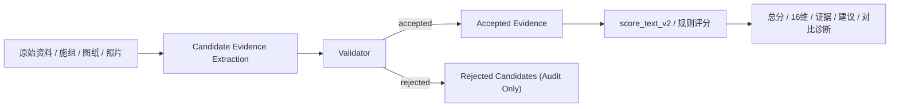

# 模型服务边界

## 1. 目标

本系统在第四轮改造后，模型能力被限制在“候选信息生产层”，不再允许越过规则评分内核直接影响最终裁决。

保留不变的核心原则：

- 最终分数仍由确定性的规则引擎计算。
- 权重是否生效、扣分是否成立、治理是否采纳、生产是否切换，仍由规则或人工治理决定。
- 模型输出必须先经过验证，再能进入评分链路。
- 模型不可用时，系统仍可执行规则评分、证据输出和运维守门。

## 2. 规划中的边界落点

### 2.1 契约层

- [app/contracts/models.py](/Users/youfeini/Desktop/ZhiFei_BizSystem/app/contracts/models.py)
- [app/ports/model_service.py](/Users/youfeini/Desktop/ZhiFei_BizSystem/app/ports/model_service.py)

这里定义了模型边界的输入输出契约：

- `EvidenceSourceArtifact`
- `CandidateEvidenceRequest`
- `CandidateEvidenceRecord`
- `CandidateEvidenceBatch`
- `SemanticAlignmentRequest`
- `SemanticAlignmentResponse`
- `EvidenceAssemblySummary`

`CandidateEvidenceRecord` 中强制保留以下可追溯字段：

- `source_ref`
- `page_locator`
- `confidence`
- `model_version`
- `prompt_or_policy_version`
- `extraction_time`
- `validator_status`

### 2.2 适配器层

- [app/infrastructure/models/no_model.py](/Users/youfeini/Desktop/ZhiFei_BizSystem/app/infrastructure/models/no_model.py)
- [app/infrastructure/models/openai_boundary.py](/Users/youfeini/Desktop/ZhiFei_BizSystem/app/infrastructure/models/openai_boundary.py)
- [app/infrastructure/models/factory.py](/Users/youfeini/Desktop/ZhiFei_BizSystem/app/infrastructure/models/factory.py)

规划中的实现：

- `NoModelService`
  - 默认降级路径
  - 不产生候选证据
  - `mode=no-model`
  - 系统保持规则评分可用
- `OpenAIModelService`
  - 仅负责候选证据抽取和语义对齐
  - 不负责最终分数、扣分或治理动作
- `build_default_model_service()`
  - 通过 `ZHIFEI_MODEL_EVIDENCE_MODE` 控制是否启用模型边界
  - 默认 `off`
  - 未配置凭证时自动回退到 `NoModelService`

## 3. 评分链路中的新位置

### 3.1 新链路

### 3.2 仓库实现位置

- 证据装配与验证：
  - [app/domain/evidence/pipeline.py](/Users/youfeini/Desktop/ZhiFei_BizSystem/app/domain/evidence/pipeline.py)
- V2 评分挂点：
  - [app/application/runtime.py](/Users/youfeini/Desktop/ZhiFei_BizSystem/app/application/runtime.py)
- 规则评分内核：
  - [app/engine/v2_scorer.py](/Users/youfeini/Desktop/ZhiFei_BizSystem/app/engine/v2_scorer.py)

目标主链路：

1. `build_scoring_evidence_package(...)` 先生成规则证据单元。
2. 调用模型服务只生成 `candidate_evidence`。
3. `_validate_candidates(...)` 只允许通过验证的候选进入 `accepted_units`。
4. `score_text_v2(..., evidence_units=scoring_units)` 只消费：
   - 规则证据单元
   - 已验证的模型证据单元
5. 候选/接受/拒绝信息写入 `report.meta.model_boundary`，用于审计和回放。

## 4. Validator 规则

当前验证器位于：

- [app/domain/evidence/pipeline.py](/Users/youfeini/Desktop/ZhiFei_BizSystem/app/domain/evidence/pipeline.py)

当前拒绝原因包括：

- `rejected_missing_snippet`
- `rejected_missing_source_ref`
- `rejected_missing_locator`
- `rejected_invalid_confidence`
- `rejected_low_confidence`
- `rejected_missing_model_metadata`
- `rejected_unknown_source_ref`
- `rejected_duplicate`

当前接受门槛：

- 置信度必须 `>= 0.55`
- 必须能映射到已声明的 `source_ref`
- 必须带页码或定位信息
- 必须带模型版本、策略版本、抽取时间
- 重复证据不进入评分

## 5. 哪些能力允许交给模型

允许：

- 非结构化文档、图纸、照片中的候选证据抽取
- 招标要求与施组内容的语义对齐
- 缺项提示、建议生成、对比诊断摘要
- 偏差分析、异常检测、候选高分特征挖掘

这些能力都属于“候选层”或“辅助分析层”，不直接形成生产裁决。

## 6. 哪些能力禁止交给模型

坚决不允许模型直接决定：

- 最终分数定案
- 权重生效
- 扣分定案
- 治理采纳定案
- 上线切换

这部分权限边界已经显式记录在每次评分结果的：

- `report.meta.model_boundary.scoring_gate`

## 7. no-model 降级模式

模型不可用时：

- `build_default_model_service()` 返回 `NoModelService`
- `candidate_evidence=[]`
- `accepted_units=[]`
- `score_text_v2()` 仍使用规则证据单元评分
- 运维巡检、health/ready/self-check/doctor/soak/trial-preflight/acceptance 不受影响

这保证了系统不会因为模型不可用而丧失评分和守门能力。

## 8. 前后可解释性对比

| 对比项 | 改造前 | 改造后 |
| --- | --- | --- |
| 模型是否能直接影响分数 | 可能绕过明确边界 | 不可，必须先过 validator |
| 模型输出是否强制带来源定位 | 不统一 | 强制要求 `source_ref + page_locator + metadata` |
| 候选证据与最终评分是否分离 | 不清晰 | 明确分为 `candidate -> accepted -> score` |
| 模型不可用时是否可评分 | 依赖调用方约定 | 明确 `no-model` 降级 |
| 审计时能否看到拒绝原因 | 弱 | 可在 `report.meta.model_boundary` 查看 |
| 规则引擎的最终裁决权 | 逻辑上保留，但边界未显式化 | 显式化并写入评分元数据 |

## 9. 首轮规划限制

- 首轮目标是先接入施组文本评分挂点。
- `EvidenceSourceArtifact` 已支持招标文件、图纸、照片等资料类型，但这些资料的全量接入仍需在上传解析和读模型拼装链路继续补齐。
- 首轮建议默认关闭模型边界，需显式配置 `ZHIFEI_MODEL_EVIDENCE_MODE=openai` 才启用 OpenAI 候选证据抽取。

## 10. 验证文件

- [tests/test_model_boundary.py](/Users/youfeini/Desktop/ZhiFei_BizSystem/tests/test_model_boundary.py)
- [tests/test_v2_pipeline.py](/Users/youfeini/Desktop/ZhiFei_BizSystem/tests/test_v2_pipeline.py)

这些测试覆盖：

- no-model 降级
- candidate evidence 校验与准入
- OpenAI 适配器补全必需元数据
- V2 评分主链路只消费 `accepted evidence`
