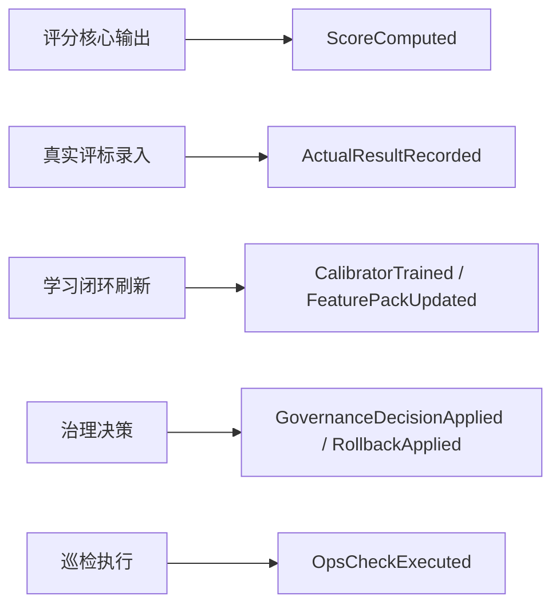

# 目标架构：基于当前仓库的“分层单体 + 事件化内核 + 受控 Agent + 混合存储”

## 1. 架构结论

本系统的目标形态不是：

- 通用 OA
- 通用文档系统
- AI 黑盒评分器
- 过早微服务化平台

而是：

**分层单体 + 事件化内核 + 受控 Agent + 混合存储**

并且这个目标必须直接落在当前仓库已经存在的结构上推进，而不是从零推翻。

## 2. 当前仓库的起点

### 规划中的第一轮结构调整

本轮规划中的第一轮分层雏形如下：

```text
app/
├── main.py                        # 兼容 API 入口 shim
├── cli.py                         # 兼容 CLI 入口 shim
├── windows_desktop.py             # 兼容桌面入口 shim
├── schemas.py                     # 兼容契约入口 shim
├── bootstrap/
│   ├── app_factory.py
│   ├── config.py
│   ├── dependencies.py
│   └── entrypoints.py
├── interfaces/
│   ├── api/
│   │   └── app.py
│   ├── cli/
│   │   └── runtime.py
│   └── windows/
│       └── secure_desktop.py
├── application/
│   ├── runtime_legacy.py
│   ├── service_registry.py
│   └── services/
│       └── workflows.py
├── contracts/
│   ├── api.py
│   ├── domain.py
│   ├── events.py
│   ├── ops.py
│   └── legacy.py
├── engine/
├── storage.py
└── 其余现存业务模块
```

这说明第一阶段不是从零起草，而是可以围绕明确的目标结构推进拆分。

### 当前仓库的约束与迁移前提

1. 大量旧编排当前仍集中在 `app/main.py`
2. `app/storage.py` 仍是主持久化门面
3. `app/engine/*` 仍同时承担核心规则、学习、模型辅助和运维诊断

因此，目标架构必须建立在“继续拆现有编排中心，而不是另起炉灶”的前提上。

## 3. 为什么当前更适合“分层单体 + 事件化内核”，而不是直接拆微服务

### 事实

1. 当前部署约束是本地部署、企业内网、低依赖。
2. 当前存储主路径仍是本地 JSON + 文件目录 + 文件锁 + DPAPI。
3. 当前评分、学习、治理、巡检共享大量上下文，且强调确定性与可回放。
4. 当前主要问题是“边界混叠”，不是“横向扩展不够”。

### 结论

直接拆微服务会把当前的单体内问题升级成跨进程问题：

- 隐式耦合变成网络耦合
- 本地文件和安全桌面机制变成跨服务协调问题
- 审计和回放从单机顺序问题变成分布式顺序问题

分层单体更合适，因为它先解决真正的问题：

1. 入口层只保留启动和适配
2. 应用服务层统一编排
3. 领域核心保持确定性裁决
4. 事件内核承担跨域通知与回放输入

## 4. 为什么 `app/main.py` 只能保留 app factory / bootstrapping，不能继续承担业务编排

### 目标约束

- `app/main.py` 最终要收缩为兼容 shim
- `app/bootstrap/*` 负责实际入口装配职责
- `app/application/services/workflows.py` 作为首个应用服务壳承接业务编排

### 必须坚持的原因

1. Web/API、CLI、Windows 必须共用一套应用服务，而不是各自复制流程。
2. 入口层不应持有共享状态和业务事务边界。
3. 一旦入口层重新吸纳业务编排，第一轮拆分就会失效。

所以，`app/main.py` 的最终职责只能是：

- 兼容入口
- app factory
- bootstrapping
- 依赖注入桥接

## 5. 为什么文件型存储需要演进为“元数据数据库 + 事件日志 + 文件存储”的混合方案

### 当前事实

- 原始资料和导出物天然是文件
- 结构化实体已经越来越像数据库数据
- 审计与回放越来越需要事件视角

### 目标分工

| 存储角色 | 适合保存什么 |
| --- | --- |
| 文件存储 | 原始招标文件、清单、图纸、照片、施组、导出物 |
| 元数据数据库 | 项目、资料索引、提交、评分摘要、证据索引、真实评标、治理动作、学习产物索引、任务状态 |
| 事件日志 | ProjectCreated、ArtifactUploaded、ScoreComputed、ActualResultRecorded、GovernanceDecisionApplied 等事件 |

### 结论

不是为了“上数据库而上数据库”，而是因为当前系统已经同时需要：

- 文件能力
- 结构化查询能力
- 事件回放能力

## 6. 评分核心、学习闭环、治理闭环、运维巡检四层如何解耦

### 四层职责

| 层 | 只负责什么 | 不负责什么 |
| --- | --- | --- |
| 评分核心层 | 最终分数、16 维度、证据、扣分项、建议、对比诊断中的规则裁决 | 训练模型、部署治理补丁 |
| 学习闭环层 | 真实评标回灌、校准器训练、特征蒸馏、反射、演化 | 直接改线上最终分数 |
| 治理闭环层 | 采纳、忽略、回退、人工确认、影响分析、版本切换 | 重新计算评分规则 |
| 运维巡检层 | health/ready/self-check/doctor/soak/preflight/acceptance/ops-agents | 直接改业务裁决 |

### 当前仓库到目标边界的映射

| 当前模块 | 目标边界 |
| --- | --- |
| `app/engine/scorer.py`、`v2_scorer.py`、`compare.py` | `app/domain/scoring/*` |
| `app/feedback_learning.py`、`ground_truth_intake.py`、`engine/reflection.py`、`engine/calibrator.py` | `app/application/learning/*` + `app/domain/learning/*` |
| `app/feedback_governance.py` | `app/application/governance/*` + `app/domain/governance/*` |
| `app/system_health.py`、`trial_preflight.py`、`engine/ops_agents.py` | `app/application/ops/*` + `app/domain/ops/*` |

### 事件流



## 7. 哪些能力继续保持规则驱动，哪些能力适合引入模型服务边界

### 继续保持规则驱动

- 最终总分
- 16 维度得分
- 扣分项
- 分制换算
- 证据门禁
- 跨资料一致性门禁
- ground truth 归一化
- 校准器上线门槛
- patch 采纳与回滚门槛
- system closure / readiness 判定

### 适合引入模型服务边界

- 候选证据补全
- 候选对比 narrative
- 满分优化清单中的候选改写内容
- 编制指导增强
- 偏差分析建议
- 运维诊断建议

### 原则

- 模型只输出 proposal
- 规则层和治理层决定是否生效
- 任何 proposal 都必须带输入来源、模型版本、prompt 版本和审计字段

## 8. 如何在不破坏现有可解释性的前提下增强可维护性和可扩展性

### 做法

1. 先拆编排，不先改裁决内核
2. 先抽存储接口，不先废弃 JSON
3. 先统一模型 proposal 协议，不让模型直写最终状态
4. 先加事件日志和回放，不把跨域更新继续做成同步直调
5. 先让三类入口复用一套用例，再考虑进一步模块化

### 对应收益

| 目标 | 做法 |
| --- | --- |
| 可维护性 | 入口、应用服务、领域核心、基础设施分层 |
| 可扩展性 | 新增 agent / repository / model adapter 时不必改评分裁决 |
| 可解释性 | 最终裁决继续由规则层负责 |
| 可回放性 | 事件日志 + 结构化索引 + 文件原件路径三者协同 |

## 9. 建议目录结构

下面的目录结构分为“首轮目标骨架”和“下一阶段要补齐”两部分。

```text
app/
├── main.py
├── cli.py
├── windows_desktop.py
├── web_ui.py
├── schemas.py
├── bootstrap/                    # 首轮目标
│   ├── app_factory.py
│   ├── config.py
│   ├── dependencies.py
│   └── entrypoints.py
├── interfaces/                   # 首轮目标
│   ├── api/
│   │   ├── app.py
│   │   └── routers/              # Phase 2 补齐
│   ├── cli/
│   │   ├── runtime.py
│   │   └── commands/             # Phase 2 补齐
│   ├── windows/
│   │   └── secure_desktop.py
│   └── web/                      # Phase 3 补齐
├── application/                  # 首轮目标骨架
│   ├── runtime_legacy.py
│   ├── service_registry.py
│   ├── services/
│   │   └── workflows.py
│   ├── projects/                 # Phase 2
│   ├── materials/                # Phase 2
│   ├── scoring/                  # Phase 2
│   ├── learning/                 # Phase 3
│   ├── governance/               # Phase 3
│   ├── ops/                      # Phase 3
│   └── agents/                   # Phase 3
├── contracts/                    # 首轮目标骨架
│   ├── api.py
│   ├── domain.py
│   ├── events.py
│   ├── ops.py
│   ├── agents.py                 # Phase 3
│   └── legacy.py
├── domain/                       # Phase 2/3
│   ├── scoring/
│   ├── learning/
│   ├── governance/
│   ├── ops/
│   └── shared/
├── ports/                        # Phase 2
│   ├── repositories.py
│   ├── event_store.py
│   ├── artifact_store.py
│   └── model_service.py
└── infrastructure/               # Phase 2/3
    ├── storage/
    ├── models/
    └── observability/
```

## 10. 分阶段迁移表

### Phase 1：入口收缩与应用服务壳

| 项目 | 内容 |
| --- | --- |
| 目标 | 让 `app/main.py`、`app/cli.py`、`app/windows_desktop.py` 只保留入口兼容；统一接入应用服务壳 |
| 当前对应 | `app/bootstrap/*`、`app/interfaces/*`、`app/application/service_registry.py`、`app/application/services/workflows.py` |
| 收益 | 统一主链路编排入口，降低 `app.main` 回潮风险 |
| 风险 | `runtime.py` 仍较大，服务层和过渡 runtime 会并存 |
| 回滚点 | 适配层临时回调 legacy helper；入口兼容层不变 |

### Phase 2：存储抽象 + 评分/资料用例继续拆分

| 项目 | 内容 |
| --- | --- |
| 目标 | 建立 `Repository` / `EventStore` / `ArtifactStore`，引入 SQLite 元数据和事件日志骨架；继续拆项目、资料、评分服务 |
| 当前对应 | `app/storage.py`、`app/application/services/workflows.py`、`app/engine/*` |
| 收益 | 为回放、联查、幂等、审计打基础；减少业务层直读 JSON |
| 风险 | 双写不一致、Projection 顺序控制 |
| 回滚点 | 读路径切回 JSON facade；关闭数据库主读开关 |

### Phase 3：四层解耦 + 受控 Agent

| 项目 | 内容 |
| --- | --- |
| 目标 | 学习闭环、治理闭环、运维巡检从 legacy runtime 中拆出；建立受控 agent 运行时 |
| 当前对应 | `app/feedback_learning.py`、`app/feedback_governance.py`、`app/system_health.py`、`app/trial_preflight.py`、`app/engine/llm_*`、`app/engine/ops_agents.py` |
| 收益 | 结构清晰、模型边界可控、系统更容易维护和扩展 |
| 风险 | 事件顺序、治理生效条件、proposal 审计如果设计不严，会破坏闭环可信度 |
| 回滚点 | 关闭 agent / subscriber，退回同步应用服务路径，规则评分继续主导裁决 |

## 11. 核心原则

无论后续如何演进，以下原则不变：

1. 规则评分保留最终裁决权
2. 模型和 agent 只输出 proposal
3. JSON 兼容路径保留，迁移以双写/适配层/开关推进
4. 任何影响分数的改动都必须有回放验证和前后差异报告
5. 系统不转型为通用 OA，不转型为黑盒 AI 评分器
