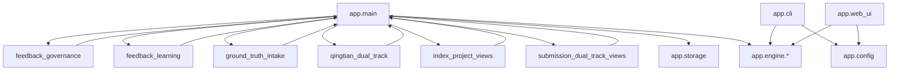

# 耦合与共享状态地图

## 1. 形式化 import 循环检测结果

基于 `app/**/*.py` 的 AST 导入图扫描结果：

- 扫描模块数：`60`
- 形式化强连通分量循环数：`0`

这说明：

- 仓库当前没有“解释器层面的硬循环 import”
- 但不代表边界健康；运行时耦合仍然很重

## 2. 反向依赖 `app.main` 的模块

以下模块直接 `import app.main as main_mod`：

| 模块 | 证据 |
| --- | --- |
| `app/feedback_learning.py` | `13` |
| `app/ground_truth_intake.py` | `10` |
| `app/qingtian_dual_track.py` | `9` |
| `app/index_project_views.py` | `10` |
| `app/submission_dual_track_views.py` | `10` |
| `app/feedback_governance.py` | `10` |

同时，`app/main.py:67-72` 又反向导入了这些模块。

这不是 import 环级别死循环，但已经形成“主文件 <-> 子模块”双向依赖模式。

## 3. 隐式共享状态与全局单例

### 3.1 `app.main` 中的共享状态

`app/main.py:656-695` 起存在一整套模块级共享状态：

- `_MATERIAL_INDEX_CACHE`
- `_MATERIAL_INDEX_CACHE_ORDER`
- `_MATERIAL_INDEX_CACHE_LOCK`
- `_MATERIAL_PARSE_STATE_LOCK`
- `_MATERIAL_PARSE_WORKER_LOCK`
- `_MATERIAL_PARSE_STOP_EVENT`
- `_MATERIAL_PARSE_WAKE_EVENT`
- `_MATERIAL_PARSE_WORKER`
- `_MATERIAL_PARSE_WORKERS`
- `_MATERIAL_PARSE_ACTIVE_PROJECTS`
- `_MATERIAL_PARSE_ACTIVE_PROJECT_CLAIMS`
- `_MATERIAL_PARSE_SCHEDULER_STATS`

这组状态既被启动生命周期使用，也被业务路由、健康检查和解析调度共同读取。

### 3.2 其他全局单例

| 模块 | 共享状态 |
| --- | --- |
| `app/cache.py` | `_score_cache`、`_cache_lock` |
| `app/config.py` | `_config_loader` |
| `app/i18n.py` | `_global_i18n` |
| `app/metrics.py` | Prometheus 全局指标对象 |
| `app/rate_limit.py` | `_RATE_WINDOW_STATE`、`_RATE_WINDOW_LOCK`、`limiter` |
| `app/storage.py` | `_PATH_LOCKS`、`_PATH_LOCKS_GUARD`、`_SECURE_RUNTIME_*` |
| `app/engine/evidence_units.py` | `_DIMENSION_META_CACHE` |
| `app/engine/llm_evolution.py` | provider failure / quality / review 运行时状态 |
| `app/engine/llm_evolution_openai.py` | `_OPENAI_KEY_FAILURES`、`_OPENAI_KEY_CURSOR`、`_OPENAI_KEY_LOCK` |
| `app/engine/llm_evolution_gemini.py` | `_GEMINI_KEY_FAILURES`、`_GEMINI_KEY_CURSOR`、`_GEMINI_KEY_LOCK` |
| `app/app.py` | `USERS`、`SESSIONS` |

## 4. 配置穿透点

环境变量不是只在一个配置中心解析，而是散落在多层：

| 模块 | 典型变量 |
| --- | --- |
| `app/main.py` | `PYTEST_CURRENT_TEST`、`DWG_CONVERTER_BIN`、`PORT`、`HOST` |
| `app/storage.py` | `ZHIFEI_DATA_DIR`、`LOCALAPPDATA`、`ZHIFEI_SECURE_DESKTOP` |
| `app/runtime_security.py` | `ALLOWED_HOSTS_ENV`、`MAX_UPLOAD_MB_ENV` |
| `app/rate_limit.py` | `RATE_LIMIT_*` |
| `app/auth.py` | `API_KEYS` |
| `app/observability.py` | `SLOW_REQUEST_WARN_MS_ENV` |
| `app/windows_desktop.py` | `ZHIFEI_SECURE_DESKTOP`、`ZHIFEI_DATA_DIR`、`PORT`、`HOST` |
| `app/engine/llm_evolution.py` | `EVOLUTION_LLM_BACKEND`、provider cooldown / degrade 变量 |
| `app/engine/llm_evolution_openai.py` | `OPENAI_API_KEY`、`OPENAI_API_KEYS` |
| `app/engine/llm_evolution_gemini.py` | `GEMINI_API_KEY`、`GEMINI_API_KEYS` |
| `app/engine/llm_judge_spark.py` | `OPENAI_MODEL`、`SPARK_MODEL` |
| `app/engine/openai_compat.py` | `OPENAI_MODEL`、`OPENAI_API_KEY` |

判断：

- 这已经不是“配置读取”问题，而是“配置协议穿透到多层模块”的问题。

## 5. 跨层导入与重复编排

### 5.1 主服务层未真正独立

事实：

- `app/windows_desktop.py` 复用 `app.main.create_app()`
- 但 `app/cli.py`、`app/web_ui.py` 并没有复用独立的应用服务层
- `app/cli.py` 直接调用 `load_config()`、`score_text()`、`run_spark_judge()`、`export_report_to_docx()`
- `app/web_ui.py` 直接调用 `load_config()`、`score_text()`、`export_report_to_docx()`

判断：

- Web/API、CLI、Windows 桌面目前共享的是“底层引擎”和“主文件中的若干 helper 语义”，不是清晰的应用服务层。

### 5.2 `app.main` 兼容别名与 patch 点

`app/main.py:309-311` 还暴露了对测试/补丁友好的别名：

- `distill_feature_from_text`
- `update_feature_confidence`
- `upsert_distilled_features`

这说明外部测试和 patch 已把 `main.py` 当成兼容边界，而不是纯入口文件。

## 6. 边界关系图

## 7. 耦合判断

先给事实：

- `app.main` 同时是入口、共享状态持有者、路由容器、页面拼装器、业务编排器。
- 若干子模块把 `app.main` 当作服务定位器使用。
- CLI / Streamlit / 旧版 `app.app` 各自还保留一部分直接编排。

再给判断：

- 当前最重的耦合不是 import 语法层，而是“主文件兼容边界 + 共享状态 + 跨层回调”。
- 后续应优先把 `app.main` 从“服务定位器”降级成“装配与路由入口”，否则任何局部重构都会继续被拉回去。
