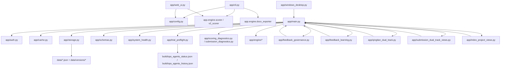

# 系统基线地图

## 1. 审计范围与结论口径

本次只做只读审计和基线固化，不做业务行为改造。

事实基线来自以下实测：

- `python3 -m pytest tests/ -q`：`1549 passed, 4 skipped`
- `./scripts/smoke_test.sh`：通过
- `python3 -m app.main`：可启动，`/health`、`/ready`、`/api/v1/system/self_check` 返回 200
- `python3 -m app.cli batch -i sample_shigong.txt -o build/audit_batch_current`：通过
- `make test`、`make run`：失败，但失败点在仓库内 `.venv`，不是业务逻辑本身

## 2. 裁剪后的目录树

```text
app/
├── engine/
│   ├── adaptive.py
│   ├── anchors.py
│   ├── calibrator.py
│   ├── compare.py
│   ├── dimensions.py
│   ├── evaluation.py
│   ├── evidence.py
│   ├── evidence_units.py
│   ├── evolution.py
│   ├── feature_distillation.py
│   ├── learning.py
│   ├── llm_evolution.py
│   ├── llm_evolution_gemini.py
│   ├── llm_evolution_openai.py
│   ├── llm_judge_spark.py
│   ├── llm_runtime_state.py
│   ├── logic_lock.py
│   ├── ops_agents.py
│   ├── preflight.py
│   ├── reflection.py
│   ├── scorer.py
│   ├── surrogate_learning.py
│   ├── template_rag.py
│   └── v2_scorer.py
├── resources/
│   ├── dimension_meta.json
│   ├── high_score_probe_dimensions.json
│   ├── lexicon.yaml
│   ├── rubric.yaml
│   └── prompts/
├── app.py
├── auth.py
├── cache.py
├── cli.py
├── config.py
├── feedback_governance.py
├── feedback_learning.py
├── ground_truth_intake.py
├── index_project_views.py
├── main.py
├── metrics.py
├── observability.py
├── qingtian_dual_track.py
├── rate_limit.py
├── runtime_security.py
├── schemas.py
├── scoring_diagnostics.py
├── storage.py
├── submission_diagnostics.py
├── submission_dual_track_views.py
├── system_health.py
├── trial_preflight.py
├── web_ui.py
└── windows_desktop.py

scripts/
├── acceptance.sh
├── browser_button_smoke.py
├── doctor.sh
├── e2e_api_flow.sh
├── mece_audit.sh
├── ops_agents.py
├── smoke_test.sh
├── stability_soak.py
└── trial_preflight.py

tests/
├── test_cli.py
├── test_main.py
├── test_ops_agents.py
├── test_storage.py
├── test_system_health.py
├── test_trial_preflight.py
├── test_v2_pipeline.py
└── 其余 40+ 个回归测试文件
```

## 3. 入口点

| 入口 | 证据 | 说明 |
| --- | --- | --- |
| FastAPI Web/API | `app/main.py:21571`, `app/main.py:51953`, `Makefile:107`, `Makefile:114` | `app = FastAPI(...)`，`create_app()` 返回同一个全局 `app` |
| CLI | `pyproject.toml` script `zhifei-score = "app.cli:app"`，`app/cli.py:66` | Typer 多子命令：`score` / `batch` / `warmup` |
| Windows 安全桌面 | `pyproject.toml` script `zhifei-secure-desktop = "app.windows_desktop:main"`，`app/windows_desktop.py:44` | 设置 `ZHIFEI_SECURE_DESKTOP` / `ZHIFEI_DATA_DIR` 后复用 `app.main.create_app()` |
| Streamlit UI | `Makefile:209`，`app/web_ui.py:55` | 与 FastAPI 并行存在的第二套 UI 入口 |
| 旧版桌面/HTTPServer 路径 | `app/app.py:145` | 独立 CSV 存储实现，和主链路不是同一服务层 |

## 4. 关键调用链

### 4.1 API 评分主链路

1. `POST /api/v1/projects/{project_id}/score`
2. `app/main.py::score_text_for_project`
3. `_resolve_project_scoring_context`
4. `_score_submission_for_project`
5. `app.engine.scorer.score_text` 或 `app.engine.v2_scorer.score_text_v2`
6. `save_submissions` / `save_score_reports` / `save_evidence_units`
7. `record_history_score`
8. 证据追溯由 `app.submission_diagnostics`、`app.scoring_diagnostics` 再读回同批结果

### 4.2 招标文件自动建项目链路

1. `POST /api/v1/projects/create_from_tender`
2. `app/main.py::create_project_from_tender`
3. `_stage_upload_file_to_temp_path`
4. `_read_tender_upload_and_infer_project_name_from_path`
5. `load_projects` / `save_projects`
6. `_store_uploaded_material_from_local_path`
7. `save_materials` / `save_material_parse_jobs`

### 4.3 学习闭环主链路

1. `POST /api/v1/projects/{project_id}/ground_truth*`
2. `save_ground_truth`
3. `_finalize_ground_truth_learning_record`
4. `_refresh_project_reflection_objects`
5. `build_delta_cases` / `build_calibration_samples`
6. `save_delta_cases` / `save_calibration_samples`
7. `POST /api/v1/projects/{project_id}/evolve`
8. `build_evolution_report`
9. `enhance_evolution_report_with_llm`
10. `save_evolution_reports`

### 4.4 运维巡检主链路

1. `/health`、`/ready`
2. `/api/v1/system/self_check`
3. `/api/v1/system/data_hygiene`
4. `/api/v1/system/improvement_overview`
5. `/api/v1/projects/{project_id}/trial_preflight`
6. `app.system_health` + `app.trial_preflight`
7. 同时混入 `app.main` 中的数据卫生、评分诊断、进化健康和 `build/ops_agents_*.json` 快照读取

## 5. 核心模块关系图



## 6. 当前系统的真实形态

先给事实：

- `app/main.py` 约 `51985` 行，包含 `172` 个路由。
- `app/main.py` 既持有 `FastAPI app`，也持有后台解析 worker、缓存、全局锁、内联 HTML/JS 页面。
- CLI、FastAPI、Windows 安全桌面并没有共用独立的应用服务层；它们共用的是底层引擎和存储函数，但编排逻辑仍分散在 `app/main.py`、`app/cli.py`、`app/web_ui.py`。
- `app/app.py` 是旧实现，仍留在仓库内。

再给判断：

- 当前架构更接近“分散入口 + 超大主编排文件 + 引擎模块库 + JSON 文件存储”，不是清晰分层单体。
- 这个结论直接决定了重构策略必须先做“拆编排、保规则、保回放、保 JSON 兼容”，不能先碰评分内核。
